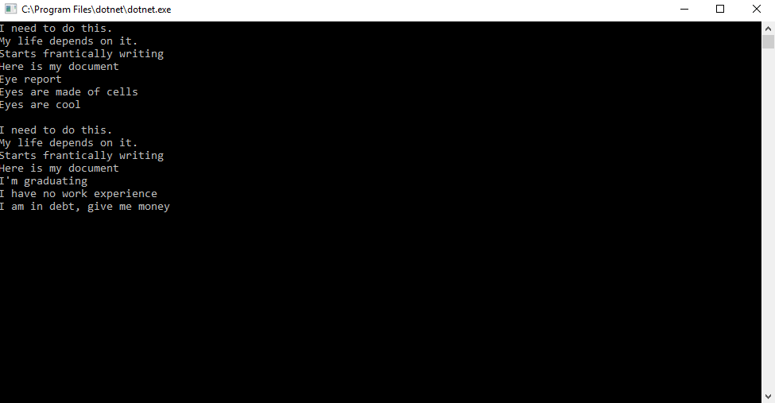

# Lab42-DesignPattern
For this project, I implemented a Factory design pattern to learn more about Industry standards
in design pattern.

## Introduction
Here we made a document creation factory.

A document is an abstract class with different properties that many kinds of document may 
share. It has 2 concrete classes, a Report and a Resume. A DocumentFactory will be able to
create a new document of specific type. 

An author is an abstract class with the ability to write and send documents. Writing a document
is an abstract method that must be defined. Sending write the document and show it on the console.
A student is derived from an author and can write a document. StudentFactory will take 
the parameter the student is given and create the apporpriate document with its content filled.

## What you need
* Install the latest Visual Studio 2017
* Have Windows OS on your device

## How to Open App
* Fork the repo from [my GitHub Page](https://github.com/Calamario)
* Git Clone the repo onto your local device
* Open .sln file with Visual Studio
* Click on the green arrow to start
* Navigate through the menu on your console

## Visual
